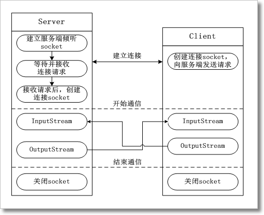

## socket通信

### 介绍

* ISO的七层模型  ： 
    
    物理层、数据链路层、网络层、传输层、表示层、会话层、应用层
     
     - Socket访问  ： 
     
        Socket属于传输层，它是对Tcp/ip协议的实现，包含TCP/UDP,它是所有通信协议的基础，Http协议需要Socket支持，以Socket作为基础
     
     -Socket通信特点：
	  
	 1. 开启端口，该通信是长连接的通信 ，很容易被防火墙拦截，可以通过心跳机制来实现（空包检测）
	  
	 2. 传输的数据一般是字符串 ，可读性不强lj|16|1|60|up  
      
     3. socket端口不便于推广 
	     
	     http:17.23.23.2:2345   www.jd.com   www.360buy.com
	  
	 4. 性能相对于其他的通信协议是最优的
     
     - Http协议访问 ：属于应用层的协议，对Socket进行了封装
     
     Http请求由三部分组成，分别是：请求行、消息报头、请求正文
     
     请求行：
     以一个方法符号开头，以空格分开，后面跟着请求的URI和协议的版本，格式如下：Method Request-URI HTTP-Version
     
     消息报头：
     
     Accept: Accept请求报头域用于指定客户端接受哪些类型的信息
     
     Host：（发送请求时，该报头域是必需的）请求报头域主要用于指定被请求资源的Internet主机和端口号，它通常从HTTP URL中提取出来的 默认80则省略
     
     Content-Type报头域中所引用的媒体类型，必须采用相应的解码机制
     
     Content-Type:text/html;charset=UTF-8
     
     HTTP响应也是由三个部分组成，分别是：状态行、消息报头、响应正文
     
     HTTP-Version Status-Code Reason-Phrase
     其中，HTTP-Version表示服务器HTTP协议的版本；Status-Code表示服务器发回的响应状态代码；Reason-Phrase表示状态代码的文本描述。
     HTTP/1.1 200 OK
      
     1. 跨平台 
	  
	 2. 传数据不够友好 ： 
	     
	     get请求： http://127.0.0.1:8888?username=lj&pwd=1234
	  
	 3. 对第三方应用提供的服务，希望对外暴露服务接口
	    
    - 问题：
       
    1. 数据封装不够友好 ：可以用xml封装数据 
       
    2. 希望给第三方应用提供web方式的服务  （http + xml） = web  Service

### 原理

 
 
 http://localhost/username
 
 
 ``从客户端获取的数据:GET /favicon.ico HTTP/1.1
   Host: localhost
   Connection: keep-alive
   User-Agent: Mozilla/5.0 (Windows NT 6.1; Win64; x64) AppleWebKit/537.36 (KHTML, like Gecko) Chrome/70.0.3538.77 Safari/537.36
   Accept: image/webp,image/apng,image/*,*/*;q=0.8
   Referer: http://localhost/username
   Accept-Encoding: gzip, deflate, br
   Accept-Language: zh-CN,zh;q=0.9,en;q=0.8
   Cookie: Idea-69a40201=d3ad719d-2ad1-408f-8586-f212cdc1479b; locale=zh; JSESSIONID=7D99FB0FA5ED8E1650D513A814EA3189``
 